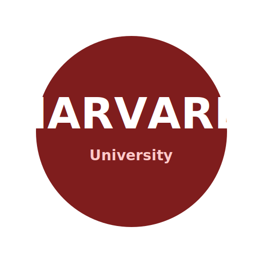

<!-- .slide: data-background-image="images/image_title.jpg" data-background-opacity="0.15" -->

## Quantum Intelligence:
#### From Equations to Artificial Intelligence

How Fundamental Sciences Are Building the Future Workforce for AI and Quantum Technologies

Note:
“Everything exciting about AI and quantum began long before the latest tools. It began with equations, with first principles, and with people trying to understand reality more deeply. My message today is simple: the future of AI will not be built only by people who use tools, but by people who understand the science beneath them.”

---

<!-- .slide: data-transition="slide-in slide-out" -->

<h2 style="font-size: 1.3em;">Einstein is my Academic Ancestor</h2>

    

        <!-- Row 1 -->
        

            

                
                
Albert Einstein

                
Princeton University

Nobel Laureate

            

            
<i class="fa-solid fa-arrow-right"></i>PostDoc

            

                
                
Otto Stern

                
University of Hamburg

Nobel Laureate

            

            
<i class="fa-solid fa-arrow-right"></i>PostDoc

            

                
                
Isidor Isaac Rabi

                
Columbia University

Nobel Laureate

            

            
<i class="fa-solid fa-arrow-right"></i>Ph.D.

            

                
                
Herbert J. Zeiger

                
MIT

            

        

        <!-- Turn around connector -->
        

             
<i class="fa-solid fa-arrow-down"></i>PostDoc

        

        <!-- Row 2 -->
        

            

                
                
Narahara Chari Dingari

                
MIT

            

            
<i class="fa-solid fa-arrow-left"></i>PostDoc

            

                
                
Michael Stephen Feld

                
MIT

            

            
<i class="fa-solid fa-arrow-left"></i>Ph.D.

            

                
                
Ali Mortimer Javan

                
MIT

            

            
<i class="fa-solid fa-arrow-left"></i>Ph.D.

            

                
                
Charles Hard Townes

                
UC Berkeley

Nobel Laureate

            

        

    

Note:
“This slide is personal, but it also makes a broader point. Knowledge compounds across generations. Ideas travel through mentors, institutions, and disciplines. What we inherit from great thinkers is not just prestige, but a standard of rigor, curiosity, and courage.”

---

<!-- .slide: data-transition="slide-in slide-out" -->

<h2 style="font-size: 1.3em;">Who am I?</h2>
 

<!-- Row 0: Education -->

Osmania University

B.Sc. Math, Physics, Chemistry

<i class="fa-solid fa-arrow-right"></i>

University of Hyderabad

M.Sc. Quantum Physics

<i class="fa-solid fa-arrow-right"></i>

University of Rhode Island

Ph.D. Physics

<i class="fa-solid fa-arrow-down"></i>

<!-- Row 1: Early Career -->

Prudential

Director

<i class="fa-solid fa-arrow-left"></i>

Dell EMC

Analytics Lead

<i class="fa-solid fa-arrow-left"></i>

MIT

PostDoc

<i class="fa-solid fa-arrow-left"></i>

Harvard

PostDoc

<i class="fa-solid fa-arrow-down"></i>

<!-- Row 2: Leadership -->

Dun & Bradstreet

Sr Director

<i class="fa-solid fa-arrow-right"></i>

Deutsche Bank

Head of Data Science

<i class="fa-solid fa-arrow-right"></i>

Powerlytics

Chief Data & Analytics Officer

<i class="fa-solid fa-arrow-right"></i>Current

Narahara Chari Dingari, Ph.D.

CDAO & Board Member

<i class="fa-solid fa-arrow-down"></i>Advisory

<!-- Row 3: Advisory -->

Full Sail Univ

Board Member

<i class="fa-solid fa-plus"></i>

DataCamp

Advisory Board

<i class="fa-solid fa-plus"></i>

WPI

Adjunct Professor

Note:
“My own journey moved from fundamental science into data, AI, and leadership across industry and academia. That path taught me that physics, mathematics, and scientific thinking are not separate from modern AI. They are the foundation that makes advanced work possible, credible, and scalable.”

---

<!-- .slide: data-transition="slide-in fade-out" -->

  

    <i class="fa-brands fa-python tools-1"></i><i class="fa-brands fa-js tools-2"></i><i class="fa-brands fa-java tools-3"></i><i class="fa-brands fa-react tools-4"></i><i class="fa-brands fa-docker tools-5"></i>
  

  

    <i class="fa-solid fa-atom phys-1"></i><i class="fa-solid fa-magnet phys-2"></i><i class="fa-solid fa-microscope phys-3"></i><i class="fa-solid fa-dna phys-4"></i><i class="fa-solid fa-flask phys-5"></i>
  

  
Tools build careers ❌

  
Thinking builds civilizations ✅

Note:
“One of the most damaging ideas students hear today is that mastering tools is enough. Tools may help you get started, but they do not create lasting advantage. Civilizations, companies, and breakthrough careers are built by people who know how to think, not just by people who know how to click.”

---

<!-- .slide: data-background-image="images/math_bg.jpg" data-background-opacity="0.25" data-transition="slide-in fade-out" -->

  

    
∇ × E = −∂B/∂t

Av = λv

P(x) = (1 / σ√(2π)) e-(x-μ)² / 2σ²

∇ · E = ρ / ε₀

det(A - λI) = 0

iℏ ∂/∂t Ψ = Ĥ Ψ

  

  
First principles compound.

Note:
“Frameworks come and go. Programming languages rise and fall. But first principles endure. The students and researchers who build from enduring ideas develop an advantage that compounds over decades, not just semesters.”

---

<!-- .slide: data-background-image="images/struggle_bg.jpg" data-background-opacity="0.25" data-background-class="ken-burns-bg" -->

  
You were trained to struggle.

Note:
“If you were trained in hard subjects, trained to derive, trained to struggle with abstraction, that is not a weakness. That is preparation. Industry increasingly rewards people who can stay with hard problems longer than everyone else.”

---

  

  

    
<i class="fa-solid fa-atom"></i>

<i class="fa-solid fa-atom"></i>

<i class="fa-solid fa-atom"></i>

<i class="fa-solid fa-atom"></i>

<i class="fa-solid fa-atom"></i>

<i class="fa-solid fa-atom"></i>

<i class="fa-solid fa-flask"></i>

<i class="fa-solid fa-square-root-variable"></i>

<i class="fa-solid fa-square-root-variable"></i>

<i class="fa-solid fa-square-root-variable"></i>

<i class="fa-solid fa-square-root-variable"></i>

  

  
Coders everywhere.   Thinkers scarce.

Note:
“The world does not have a shortage of people who can code. It has a shortage of people who can reason across systems. In the AI era, scarcity is shifting away from technical syntax and toward conceptual depth.”

---

  
Math = Representation of Reality

  

Note:
“Mathematics is the language we use to represent structure, pattern, and uncertainty in the real world. Every serious AI system is, at its core, an attempt to translate reality into a form a machine can learn from. The stronger your mathematical intuition, the stronger your AI intuition becomes.”

---

  
Vectors → Embeddings   Matrices → Learning

Note:
“When students learn vectors and matrices, it often feels abstract. But in AI, those abstractions become embeddings, transformations, and learned representations. What once looked theoretical now sits at the heart of modern machine intelligence.”

---

  
Learning = Optimization

Note:
“Learning is optimization. Behind every impressive model is a system adjusting itself through gradients, error, and correction. Calculus is not distant from AI. It is one of the engines that makes learning possible.”

---

<canvas class="bell-curve-container"></canvas>

  
No probability = No trust

Note:
“In real life, prediction without uncertainty is not intelligence. It is overconfidence. Probability gives us humility, calibration, and trust. In an AI-driven world, the people who understand uncertainty will make better decisions than the people who only understand outputs.”

---

<canvas class="energy-landscape-container"></canvas>

  
AI is a system governed by constraints.

Note:
“Physics teaches a discipline of thinking in terms of systems, tradeoffs, and constraints. AI systems do not fail only because of bad models. They fail when we ignore boundaries, incentives, energy, scale, and complexity. Physics trains us to respect the structure of reality.”

---

<canvas class="entropy-tree-container"></canvas>

  

    

      Entropy → Decision trees
      Entropy → LLMs (Tokens)
    

    
Energy → Optimization

  

Note:
“Many ideas we celebrate in AI today are deeply connected to concepts long familiar to physics. Entropy, energy, stability, optimization, all of these ideas reappear in machine learning under new labels. Physics did not disappear. It quietly became part of the AI toolkit.”

---

<canvas class="airflow-pipeline-container"></canvas>

  
Not data.   Not compute.   Systems.

Note:
“When AI initiatives fail in the real world, the reason is often not a lack of data or compute alone. It is poor systems thinking. Weak pipelines, unclear objectives, bad incentives, and fragile processes break more AI programs than algorithms do.”

---

<canvas class="molecular-network-container"></canvas>

  
Interactions matter.

Note:
“Chemistry teaches us that interactions matter. Outcomes are rarely driven by one variable in isolation. In AI, that same mindset matters when we think about features, dependencies, and relationships across a system.”

---

<canvas class="drug-heatmap-container"></canvas>

  
Chemistry × AI = Impact

Note:
“One of the most exciting frontiers ahead is where chemistry and AI meet. Drug discovery, materials science, molecular design, and biological understanding will all accelerate through better computational intelligence. This is one place where deep science can create enormous human and economic value.”

---

<canvas class="biology-ai-container"></canvas>

  
Brain → Neural Networks
 
  
Synapses → Weights

Note:
“Biology also shaped the way we think about intelligence. Neural networks borrow inspiration from the brain, but the bigger lesson is this: nature has always been a great teacher of complex systems. The more we understand living systems, the better we become at building adaptive ones.”

---

<canvas class="the-maturity-stack-container"></canvas>

  
Foundations → Frontiers

Note:
“There is a natural stack to intellectual growth. Foundations come first, then methods, then applications, then frontiers. People often want to jump directly to the frontier. But durable careers are built by mastering the layers beneath it.”

---

<canvas class="noise-signal-container"></canvas>

  
Data Science = Math + Stats + Computers + Business Context
  
    
 Not Dashboards Decisions

Note:
“Data science is often reduced to dashboards and reporting, but that is far too narrow. At its best, data science is structured decision-making under uncertainty. It is where mathematics, computing, and business judgment meet.”

---

<canvas class="AI-meets-reality-container"></canvas>

  
AI meets reality

Note:
“The moment AI leaves the lab, it enters the complexity of the real world. Healthcare, finance, climate, manufacturing, and public systems do not reward narrow thinking. They reward people who can connect disciplines and solve messy, consequential problems.”

---

<canvas class="physics-returns-container"></canvas>

  
Physics returns.

Note:
“Quantum is a reminder that the future often circles back to fundamentals. This field will reward depth, patience, and conceptual clarity. In quantum, as in AI, the winners will not be the fastest trend followers, but the deepest thinkers.”

---

<canvas class="india-map-container"></canvas>

  
From services to sovereignty.

Note:
“This is an important moment for India and for every nation thinking about its role in the future of technology. The opportunity is not just to provide services, but to shape intellectual sovereignty, scientific leadership, and original innovation. The next wave belongs to countries that produce thinkers, not only labor.”

---

<canvas class="career-advantage-container"></canvas>

  
The best careers are built on problem framing, not tool chasing

  

Note:
“Students often ask what skill will matter most in the future. My answer is problem framing. Those who can ask sharper questions, define the problem correctly, and connect theory to action will outperform those who simply chase the newest platform.”

---

<canvas class="future-belongs-container"></canvas>

  
Those who can reason from fundamentals will shape what comes next.

  

Note:
“The future belongs to people who can reason from fundamentals. These are the people who stay calm when tools change, who adapt faster when industries shift, and who can create clarity when others only see noise. That kind of thinking becomes more valuable, not less, in times of disruption.”

---

<canvas class="AI-will-replace-container"></canvas>

  
AI will automate execution. Scientists will drive discovery. 

  

Note:
“AI will automate many forms of execution, and that change is already underway. But that does not reduce the need for scientific thinkers. It increases it. The people who can form hypotheses, test assumptions, and separate signal from noise will become even more important.”

---

<canvas class="final-thought-container"></canvas>

  
Think beyond the code. Build what others cannot yet imagine. 

  

Note:
“So the real goal is not just to learn how to use the tools of today. It is to develop the depth to build what others cannot yet imagine. The future will reward original thinkers who combine curiosity, rigor, and courage.”

---

<canvas class="thank-you-container"></canvas>

  
Thank You.

  
The equation never changes. Curiosity × Rigor = Impact.

  

    
SciEncephalon AI

    

    
We bring clarity to your ambiguity

  

Note:
“I will close with one belief that has guided my own journey: the equation never changes. Curiosity multiplied by rigor creates impact. That is true in science, in AI, in quantum, and in leadership.”
