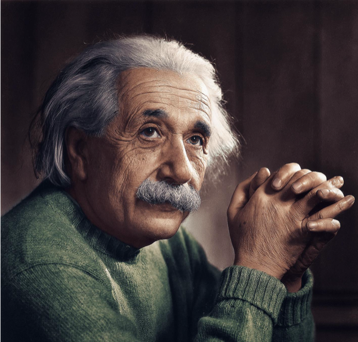
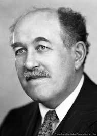

<!-- .slide: data-background-image="images/image_title.jpg" data-background-opacity="0.15" -->

## Quantum Intelligence:
#### From Equations to Artificial Intelligence

How Fundamental Sciences Are Building the Future Workforce for AI and Quantum Technologies

Note:
“Everything you are excited about today, AI, ML, Quantum, started as equations on a blackboard. This talk is about why that still matters more than ever.”

---

<!-- .slide: data-transition="slide-in slide-out" -->

<h2 style="font-size: 1.3em;">Einstein is my Academic Ancestor</h2>

    

        <!-- Row 1 -->
        

            

                
                
Albert Einstein

                
Princeton University

Nobel Laureate

            

            
<i class="fa-solid fa-arrow-right"></i>PostDoc

            

                
                
Otto Stern

                
University of Hamburg

Nobel Laureate

            

            
<i class="fa-solid fa-arrow-right"></i>PostDoc

            

                
                
Isidor Isaac Rabi

                
Columbia University

Nobel Laureate

            

            
<i class="fa-solid fa-arrow-right"></i>Ph.D.

            

                
                
Herbert J. Zeiger

                
MIT

            

        

        <!-- Turn around connector -->
        

             
<i class="fa-solid fa-arrow-down"></i>PostDoc

        

        <!-- Row 2 -->
        

            

                
                
Narahara Chari Dingari

                
MIT

            

            
<i class="fa-solid fa-arrow-left"></i>PostDoc

            

                
                
Michael Stephen Feld

                
MIT

            

            
<i class="fa-solid fa-arrow-left"></i>Ph.D.

            

                
                
Ali Mortimer Javan

                
MIT

            

            
<i class="fa-solid fa-arrow-left"></i>Ph.D.

            

                
                
Charles Hard Townes

                
UC Berkeley

Nobel Laureate

            

        

    

Note:
"My academic lineage traces back to Albert Einstein..."

---

<!-- .slide: data-transition="slide-in slide-out" -->

<h2 style="font-size: 1.3em;">Who am I?</h2>
 

<!-- Row 0: Education -->

Osmania University

B.Sc. Math, Physics, Chemistry

<i class="fa-solid fa-arrow-right"></i>

University of Hyderabad

M.Sc. Quantum Physics

<i class="fa-solid fa-arrow-right"></i>

University of Rhode Island

Ph.D. Physics

<i class="fa-solid fa-arrow-down"></i>

<!-- Row 1: Early Career -->

Prudential

Director

<i class="fa-solid fa-arrow-left"></i>

Dell EMC

Analytics Lead

<i class="fa-solid fa-arrow-left"></i>

MIT

PostDoc

<i class="fa-solid fa-arrow-left"></i>

Harvard

PostDoc

<i class="fa-solid fa-arrow-down"></i>

<!-- Row 2: Leadership -->

Dun & Bradstreet

Sr Director

<i class="fa-solid fa-arrow-right"></i>

Deutsche Bank

Head of Data Science

<i class="fa-solid fa-arrow-right"></i>

Powerlytics

Chief Data & Analytics Officer

<i class="fa-solid fa-arrow-right"></i>Current

Narahara Chari Dingari, Ph.D.

CDAO & Board Member

<i class="fa-solid fa-arrow-down"></i>Advisory

<!-- Row 3: Advisory -->

Full Sail Univ

Board Member

<i class="fa-solid fa-plus"></i>

DataCamp

Advisory Board

<i class="fa-solid fa-plus"></i>

WPI

Adjunct Professor

Note:
"A journey from academia to data leadership..."

---

<!-- .slide: data-transition="slide-in fade-out" -->

  

    <i class="fa-brands fa-python tools-1"></i><i class="fa-brands fa-js tools-2"></i><i class="fa-brands fa-java tools-3"></i><i class="fa-brands fa-react tools-4"></i><i class="fa-brands fa-docker tools-5"></i>
  

  

    <i class="fa-solid fa-atom phys-1"></i><i class="fa-solid fa-magnet phys-2"></i><i class="fa-solid fa-microscope phys-3"></i><i class="fa-solid fa-dna phys-4"></i><i class="fa-solid fa-flask phys-5"></i>
  

  
Tools build careers ❌

  
Thinking builds civilizations ✅

Note:
“The world is lying to students. It says tools matter most. Tools don’t survive decades. Thinking does.”

---

<!-- .slide: data-background-image="images/math_bg.jpg" data-background-opacity="0.25" data-transition="slide-in fade-out" -->

  

    
∇ × E = −∂B/∂t

Av = λv

P(x) = (1 / σ√(2π)) e-(x-μ)² / 2σ²

∇ · E = ρ / ε₀

det(A - λI) = 0

iℏ ∂/∂t Ψ = Ĥ Ψ

  

  
First principles compound.

Note:
“Frameworks changed every five years. These didn’t change in 200 years. That’s your unfair advantage.”

---

<!-- .slide: data-background-image="images/struggle_bg.jpg" data-background-opacity="0.25" data-background-class="ken-burns-bg" -->

  
You were trained to struggle.

Note:
“That struggle you complain about is exactly what global industry is desperate for.”

---

  

  

    
<i class="fa-solid fa-atom"></i>

<i class="fa-solid fa-atom"></i>

<i class="fa-solid fa-atom"></i>

<i class="fa-solid fa-atom"></i>

<i class="fa-solid fa-atom"></i>

<i class="fa-solid fa-atom"></i>

<i class="fa-solid fa-flask"></i>

<i class="fa-solid fa-square-root-variable"></i>

<i class="fa-solid fa-square-root-variable"></i>

<i class="fa-solid fa-square-root-variable"></i>

<i class="fa-solid fa-square-root-variable"></i>

  

  
Coders everywhere.   Thinkers scarce.

Note:
“AI didn’t create a shortage of coders. It created a shortage of people who understand systems.”

---

  
Math = Representation of Reality

  

Note:
“Every ML model is just math trying to approximate reality.”

---

  
Vectors → Embeddings   Matrices → Learning

Note:
“When you learned eigenvectors, you were already preparing for AI, you just didn’t know it.”

---

  
Learning = Optimization

Note:
“Backpropagation is not magic. It’s calculus doing hard labor.”

---

<canvas class="bell-curve-container"></canvas>

  
No probability = No trust

Note:
“AI without uncertainty is just arrogance at scale.”

---

<canvas class="energy-landscape-container"></canvas>

  
AI is a system governed by constraints.

Note:
“Physics teaches us that every system operates within constraints. AI is no different. Models, data, compute, and incentives all shape outcomes. When those constraints are poorly understood or ignored, systems become fragile, unreliable, and difficult to scale.”

---

<canvas class="entropy-tree-container"></canvas>

  

    

      Entropy → Decision trees
      Entropy → LLMs (Tokens)
    

    
Energy → Optimization

  

Note:
“Physics never disappeared. It rebranded as machine learning.”

---

<canvas class="airflow-pipeline-container"></canvas>

  
Not data.   Not compute.   Systems.

Note:
“Stop thinking about files and folders. Start thinking about energy and information.”

---

<canvas class="molecular-network-container"></canvas>

  
Interactions matter.

---

<canvas class="drug-heatmap-container"></canvas>

  
Chemistry × AI = Impact

---

<canvas class="biology-ai-container"></canvas>

  
Brain → Neural Networks
 
  
Synapses → Weights

---

<canvas class="the-maturity-stack-container"></canvas>

  
Foundations → Frontiers

---

<canvas class="noise-signal-container"></canvas>

  
Data Science = Math + Stats + Computers + Business Context
  
    
 Not Dashboards Decisions

---

<canvas class="AI-meets-reality-container"></canvas>

  
AI meets reality

---

<canvas class="physics-returns-container"></canvas>

  
Physics returns.

---

<canvas class="india-map-container"></canvas>

  
From services to sovereignty.

---

<canvas class="career-advantage-container"></canvas>

  
The best careers are built on problem framing, not tool chasing

  

---

<canvas class="future-belongs-container"></canvas>

  
Those who can reason from fundamentals will shape what comes next.

  

---

<canvas class="AI-will-replace-container"></canvas>

  
AI will automate execution. Scientists will drive discovery. 

  

---

<canvas class="final-thought-container"></canvas>

  
Think beyond the code. Build what others cannot yet imagine. 

  

---

<canvas class="thank-you-container"></canvas>

  
Thank You.

  
The equation never changes. Curiosity × Rigor = Impact.

  

    
SciEncephalon AI

    

    
We bring clarity to your ambiguity

  

